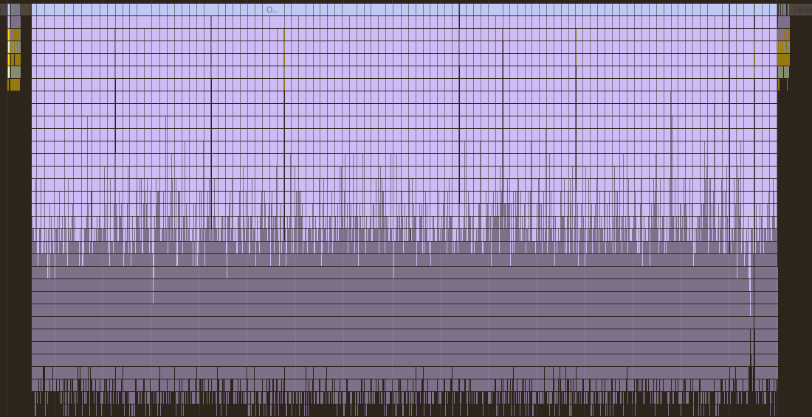
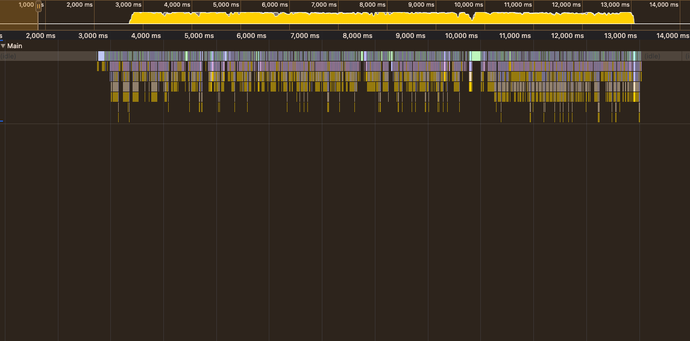

The Node.js event loop was blocked by the unoptimized synchronous Fibonacci function (fib(n)) at /api/process-data, since it performs CPU-intensive calculations on the main thread.

To fix this, I used Worker Threads, which allow heavy computations to run in parallel on separate threads. This ensures the main event loop remains responsive to I/O while workers handle CPU-bound tasks.

I implemented the worker pool pattern because it ensures requests are distributed across a fixed set of workers, avoiding event loop blocking and improving latency.

This was how i used the worker thread
Instead of spawning a worker for every request, you:

1. Start a fixed pool of workers when the server boots.
2. Maintain a job queue.
3. Assign incoming requests to an available worker immediately.
4. If all workers are busy, requests wait in a short queue instead of creating new worker threads.
   This way:

- Worker spin-up cost is paid once at startup.
- Each request only pays the actual Fibonacci calculation time.

Comparism between the old and the new

unoptimized code
latency = 5,000ms(5s)
output = 3.5 req/s

optimized code
latency = 64.23ms(0.064s)
output = 1.544 req/s

%improvement: (5000−64.23)/5000 ×100 ≈ 98.72%

test with: autocannon -c 100 -d 10 -m POST -H "Content-Type: application/json" -b '{"n":35}' http://localhost:3000/api/process-data
