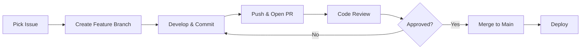
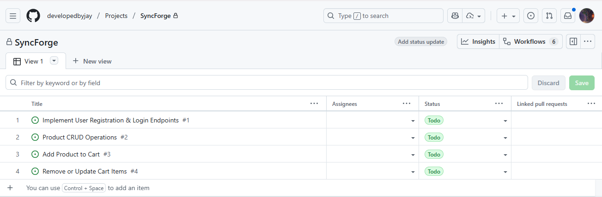
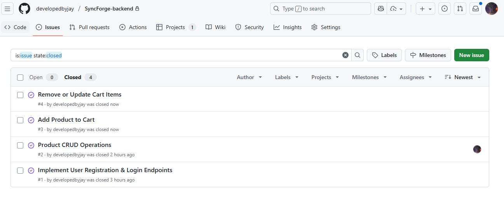
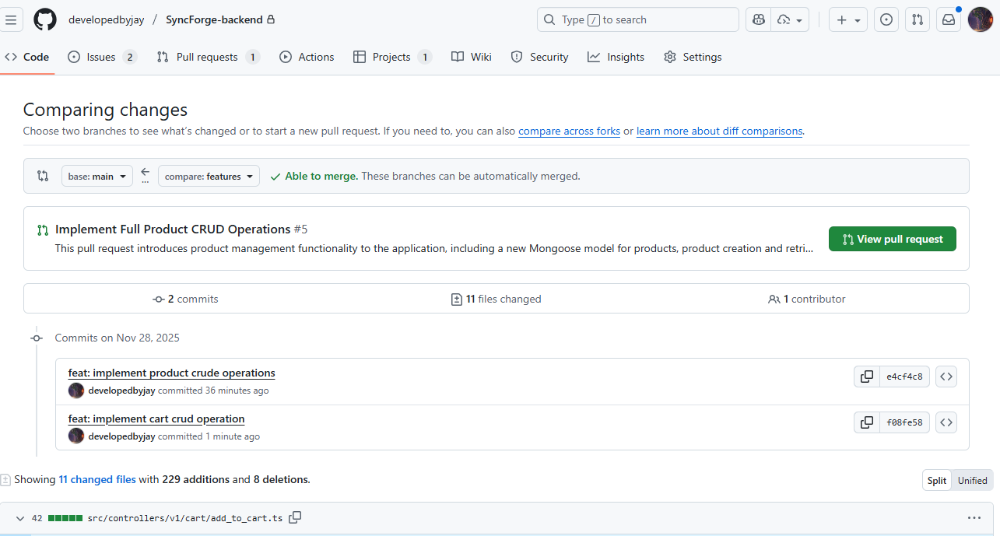

# SyncForge Backend

> A collaborative Node.js + Express backend built with distributed team workflows in mind

[](https://opensource.org/licenses/MIT)

## Table of Contents

- [Project Overview](#project-overview)
- [Tech Stack](#tech-stack)
- [Getting Started](#getting-started)
- [API Documentation](#api-documentation)
- [Collaboration Workflow](#collaboration-workflow)
- [Branching Strategy](#branching-strategy)
- [Code Review Philosophy](#code-review-philosophy)
- [GitHub Project Management](#github-project-management)
- [Pull Request Process](#pull-request-process)
- [Automation & CI/CD](#automation--cicd)
- [Team Guidelines](#team-guidelines)
- [Contributing](#contributing)

## Project Overview

SyncForge Backend is part of a distributed team collaboration challenge designed to demonstrate real-world engineering practices for remote teams across 10+ countries. This repository showcases:

- Clean Git workflows and branching strategies
- Structured Pull Request processes
- Mock code reviews with actionable feedback
- Automated testing and linting via GitHub Actions
- Clear documentation for async collaboration

## Tech Stack

- **Runtime**: Node.js (v18+)
- **Framework**: Express.js
- **Language**: TypeScript
- **Database**: MongoDB with Mongoose ODM
- **Authentication**: JWT (JSON Web Tokens)
- **Package Manager**: pnpm
- **Code Quality**: ESLint, Prettier
- **CI/CD**: GitHub Actions

## Getting Started

### Prerequisites

- Node.js v18 or higher
- pnpm v8 or higher
- MongoDB instance (local or cloud)

### Installation

1. Clone the repository:

```bash
git clone https://github.com/developedbyjay/SyncForge-backend.git
cd SyncForge-backend
```

2. Install dependencies:

```bash
pnpm install
```

3. Set up environment variables:

```bash
cp .env.example .env
# Edit .env with your configuration
```

4. Start the development server:

```bash
pnpm dev
```

The server will start on `http://localhost:3000` (or your configured port).

### Available Scripts

```bash
pnpm dev          # Start development server with hot reload
pnpm build        # Build TypeScript to JavaScript
pnpm start        # Start production server
pnpm lint         # Run ESLint
pnpm lint:fix     # Fix ESLint issues automatically
pnpm test         # Run test suite
```

## API Documentation

### Authentication Endpoints

#### POST `/api/v1/auth/register`

Create a new user account.

**Request Body:**

```json
{
  "email": "user@example.com",
  "password": "securePassword123",
  "name": "John Doe"
}
```

**Response:**

```json
{
  "success": true,
  "data": {
    "user": { "id": "...", "email": "...", "name": "..." },
    "token": "jwt_token_here"
  }
}
```

#### POST `/api/v1/auth/login`

Authenticate an existing user.

**Request Body:**

```json
{
  "email": "user@example.com",
  "password": "securePassword123"
}
```

#### POST `/api/v1/auth/logout`

Invalidate user session (requires authentication).

### Product Endpoints

#### GET `/api/v1/products`

Retrieve all products (paginated).

**Query Parameters:**

- `page` (optional): Page number (default: 1)
- `limit` (optional): Items per page (default: 10)

#### POST `/api/v1/products`

Create a new product (requires authentication & admin role).

**Request Body:**

```json
{
  "name": "Product Name",
  "description": "Product description",
  "price": 99.99,
  "stock": 50
}
```

### Cart Endpoints

#### GET `/api/v1/cart`

Get all items in user's cart (requires authentication).

#### POST `/api/v1/cart/add`

Add item to cart (requires authentication).

**Request Body:**

```json
{
  "productId": "product_id_here",
  "quantity": 2
}
```

#### GET `/api/v1/cart/length`

Get total number of items in cart (requires authentication).

## Collaboration Workflow

### Our Remote-First Philosophy

As a distributed team across 10+ countries, we follow these principles:

1. **Async-First Communication**: Don't expect immediate responses. Use detailed PR descriptions and issue comments.
2. **Documentation Over Meetings**: Write it down. If it's not documented, it doesn't exist.
3. **Timezone Awareness**: Tag issues with urgency levels. Respect working hours.
4. **Overcommunicate**: When in doubt, add more context to PRs and issues.

### Daily Workflow



1. **Start your day**: Check GitHub Project board for assigned issues
2. **Pick a task**: Move issue to "In Progress"
3. **Create branch**: Follow naming convention (see below)
4. **Develop**: Make focused, atomic commits
5. **Push & PR**: Open PR with template, link issue
6. **Respond to reviews**: Address feedback promptly
7. **Merge**: Squash and merge after approval

## Branching Strategy

We follow a **modified Gitflow** strategy optimized for continuous delivery:

### Branch Types

| Branch Type | Naming Convention                      | Purpose                 | Lifetime  |
| ----------- | -------------------------------------- | ----------------------- | --------- |
| `main`      | `main`                                 | Production-ready code   | Permanent |
| `develop`   | `develop`                              | Integration branch      | Permanent |
| Feature     | `feature/issue-{number}-{description}` | New features            | Temporary |
| Bugfix      | `bugfix/issue-{number}-{description}`  | Bug fixes               | Temporary |
| Hotfix      | `hotfix/{description}`                 | Urgent production fixes | Temporary |
| Release     | `release/v{version}`                   | Release preparation     | Temporary |

### Examples

```bash
# Good branch names
feature/issue-23-user-authentication
bugfix/issue-45-cart-calculation-error
hotfix/critical-security-patch

# Bad branch names
jay-feature
test
fix
```

### Branch Protection Rules

**`main` branch:**

- ✅ Require pull request reviews (minimum 1)
- ✅ Require status checks to pass
- ✅ Require branches to be up to date
- ✅ No direct pushes
- ✅ No force pushes

**`develop` branch:**

- ✅ Require pull request reviews (minimum 1)
- ✅ Require status checks to pass

### Merging Strategy

- **Feature → Develop**: Squash and merge (keeps history clean)
- **Develop → Main**: Merge commit (preserves release history)
- **Hotfix → Main**: Merge commit, then backport to develop

## Code Review Philosophy

### Why We Review

Code reviews are **NOT** about finding faults—they're about:

- **Knowledge sharing** across timezones
- **Catching bugs** before production
- **Maintaining consistency** in a distributed codebase
- **Mentoring** junior developers asynchronously

### Review Guidelines

#### For Authors

1. **Self-review first**: Review your own diff before requesting others
2. **Keep PRs small**: Aim for < 400 lines of code
3. **Provide context**: Explain _why_, not just _what_
4. **Add screenshots**: For UI changes or API responses
5. **Link issues**: Use "Closes #123" in description
6. **Respond promptly**: Acknowledge feedback within 24 hours

#### For Reviewers

1. **Be respectful**: Use "we" instead of "you"
2. **Ask questions**: "What do you think about...?" instead of "This is wrong"
3. **Differentiate severity**:
   - **Blocker**: Must fix before merge
   - **Important**: Should fix, but not blocking
   - **Suggestion**: Nice to have
   - **Question**: Seeking clarification
4. **Praise good code**: Call out clever solutions
5. **Review within 48 hours**: Don't block teammates

### Code Review Checklist

- [ ] Code follows project style guide
- [ ] No console.logs or debugging code
- [ ] Error handling is comprehensive
- [ ] Tests pass locally
- [ ] No security vulnerabilities (SQL injection, XSS, etc.)
- [ ] Environment variables used for secrets
- [ ] API responses follow standard format
- [ ] TypeScript types are properly defined
- [ ] Comments explain _why_, not _what_
- [ ] Documentation updated if needed

## GitHub Project Management

We use **GitHub Projects** with a Kanban board to track all work:

### Board Columns

1. **Backlog**: Ideas and future work
2. **Ready**: Prioritized and ready to start
3. **In Progress**: Actively being worked on (limit: 2 per person)
4. **In Review**: PR open, awaiting review
5. **Done**: Merged and deployed

### Issue Management



Every task starts as a GitHub Issue with:

#### Issue Template Structure

```markdown
## Description

[Clear description of the feature/bug]

## Acceptance Criteria

- [ ] Criterion 1
- [ ] Criterion 2
- [ ] Criterion 3

## Technical Details

[Any technical context, API endpoints, dependencies]

## Definition of Done

- [ ] Code written and tested
- [ ] PR created and reviewed
- [ ] Tests passing
- [ ] Documentation updated
```

#### Issue Labels

| Label              | Purpose                    | Color     |
| ------------------ | -------------------------- | --------- |
| `feature`          | New functionality          | `#0E8A16` |
| `bug`              | Something isn't working    | `#D73A4A` |
| `documentation`    | Documentation improvements | `#0075CA` |
| `urgent`           | High priority              | `#FF0000` |
| `good first issue` | Good for newcomers         | `#7057FF` |



### Example Issues Created

1. **Issue #23**: Implement JWT-based authentication
2. **Issue #24**: Create product CRUD endpoints
3. **Issue #25**: Add cart management functionality
4. **Issue #26**: Set up MongoDB connection with Mongoose
5. **Issue #27**: Configure GitHub Actions for CI/CD

## Pull Request Process

### PR Template

Every PR uses our template (automatically loaded from `.github/PULL_REQUEST_TEMPLATE.md`):

```markdown
## Description

[What does this PR do? Why is it needed?]

## Related Issue

Closes #[issue number]

## Changes Made

- Change 1
- Change 2
- Change 3

## Testing

- [ ] Unit tests added/updated
- [ ] Manual testing completed
- [ ] All tests passing

## Screenshots/API Examples

[Add screenshots for UI changes or curl/Postman examples for API changes]

## Checklist

- [ ] Code follows style guidelines
- [ ] Self-reviewed the code
- [ ] Commented complex logic
- [ ] Updated documentation
- [ ] No new warnings generated
- [ ] Added tests that prove fix/feature works
- [ ] New and existing tests pass locally

## Deployment Notes

[Any special deployment considerations? Database migrations? Environment variables?]

## Reviewers

@teammate1 @teammate2
```

### PR Examples


**PR #12**: Implement User Authentication System

- Added JWT token generation and validation
- Created login/register/logout endpoints
- Added middleware for protected routes
- Linked to Issue #23



**PR #15**: Add Product Management Endpoints

- Implemented CRUD operations for products
- Added pagination support
- Created Mongoose schema with validation
- Linked to Issue #24

### Mock Code Review Examples

#### Review 1: Authentication PR

**Reviewer**: @senior-dev-maria  
**Comments**:

```
[Important] Line 45: Consider adding rate limiting to prevent brute force attacks
Suggestion: Use express-rate-limit middleware

[Suggestion] Line 78: Nice work on the password hashing!
Consider extracting salt rounds to environment variable for flexibility

[Blocker] Line 120: Security issue - JWT secret is hardcoded
Must use environment variable before merge

[Question] Line 156: Why 24h expiry?
Should we discuss shorter expiry with refresh tokens for better security?
```

**Author Response**: Addressed all feedback in commits abc123 and def456. Great catch on the JWT secret! Updated expiry to 1h and added refresh token logic.

#### Review 2: Product Endpoints PR

**Reviewer**: @tech-lead-james  
**Comments**:

```
Overall structure looks great!

[Suggestion] Line 34: Consider adding input sanitization to prevent NoSQL injection
We could use express-validator or mongoose-sanitize

[Important] Line 89: This query could be slow with large datasets
Recommend adding database indexes on frequently queried fields

Line 145: Excellent error handling! This is exactly how we should do it across the codebase
```

## Automation & CI/CD

### GitHub Actions Workflows

We use GitHub Actions for continuous integration:

**`.github/workflows/node.js.yml`**

```yaml
name: Node.js CI

on:
  push:
    branches: [main, develop, feature/*]
  pull_request:
    branches: [main, develop]

jobs:
  test:
    runs-on: ubuntu-latest

    strategy:
      matrix:
        node-version: [18.x, 20.x]

    steps:
      - uses: actions/checkout@v3

      - name: Use Node.js ${{ matrix.node-version }}
        uses: actions/setup-node@v3
        with:
          node-version: ${{ matrix.node-version }}

      - name: Install pnpm
        run: npm install -g pnpm

      - name: Install dependencies
        run: pnpm install

      - name: Run linter
        run: pnpm lint

      - name: Run tests
        run: pnpm test

      - name: Build
        run: pnpm build
```

### Automated Checks

Every PR triggers:

- ✅ **Linting**: ESLint checks code style
- ✅ **Type Checking**: TypeScript compilation
- ✅ **Unit Tests**: Jest test suite
- ✅ **Build Verification**: Ensures code compiles
- ✅ **Security Scanning**: Dependency vulnerability checks

**All checks must pass before merge.**

## Team Guidelines

### Communication Channels

| Channel       | Purpose                 | Response Time     |
| ------------- | ----------------------- | ----------------- |
| GitHub Issues | Feature requests, bugs  | 24-48 hours       |
| PR Comments   | Code review discussions | 24 hours          |
| PR Reviews    | Blocking feedback       | 12-24 hours       |
| README        | Source of truth         | Always up-to-date |

### Working Hours & Timezones

Team members span multiple timezones:

- **Europe**: GMT to GMT+3
- **Americas**: EST to PST
- **Asia-Pacific**: IST to JST

**Guidelines**:

- No expectation of immediate response
- Use issue/PR labels for urgency
- Schedule releases for overlap hours (12:00-15:00 UTC)
- Record important decisions in GitHub Discussions

### Commit Message Convention

We follow **Conventional Commits**:

```
<type>(<scope>): <subject>

<body>

<footer>
```

**Types**:

- `feat`: New feature
- `fix`: Bug fix
- `docs`: Documentation changes
- `style`: Code style changes (formatting)
- `refactor`: Code refactoring
- `test`: Adding/updating tests
- `chore`: Maintenance tasks

**Examples**:

```
feat(auth): add JWT token refresh mechanism

Implemented refresh token logic to extend user sessions
without requiring re-authentication.

Closes #34
```

```
fix(cart): resolve quantity calculation bug

Fixed issue where cart totals were incorrect when items
had different quantities.

Fixes #56
```

## Contributing

### For Team Members

1. Pick an issue from the "Ready" column
2. Assign yourself and move to "In Progress"
3. Create feature branch following naming convention
4. Develop with frequent, atomic commits
5. Push and open PR with template
6. Respond to review feedback
7. Merge after approval

### For External Contributors

We welcome contributions! Please:

1. Fork the repository
2. Create a feature branch
3. Make your changes
4. Add tests
5. Open a PR with clear description
6. Wait for review

## License

MIT License - see LICENSE file for details

## Contact & Support

- **Repository**: [github.com/developedbyjay/SyncForge-backend](https://github.com/developedbyjay/SyncForge-backend)
- **Issues**: [GitHub Issues](https://github.com/developedbyjay/SyncForge-backend/issues)
- **Project Board**: [GitHub Projects](https://github.com/developedbyjay/SyncForge-backend/projects)
