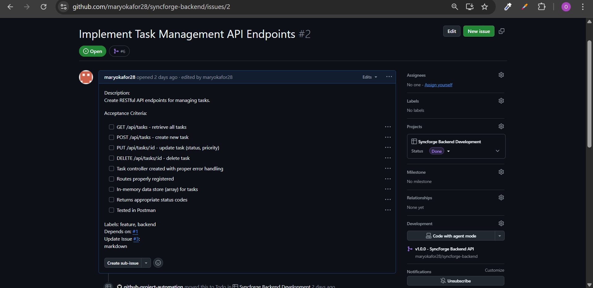
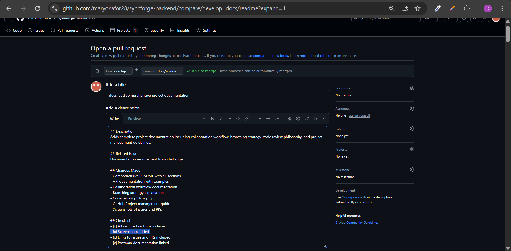

# SyncForge Backend API

> A fully remote-collaborative backend project demonstrating distributed team workflows, code review practices, and professional Git collaboration using Node.js, Express, and TypeScript

## 📋 Table of Contents

- [Overview](#overview)
- [Features](#features)
- [Tech Stack](#tech-stack)
- [Getting Started](#getting-started)
- [API Documentation](#api-documentation)
- [Collaboration Workflow](#collaboration-workflow)
- [Branching Strategy](#branching-strategy)
- [Code Review Philosophy](#code-review-philosophy)
- [GitHub Project Management](#github-project-management)

---

## 🎯 Overview

SyncForge Backend is a fully-featured task management API designed to demonstrate professional software engineering practices in a distributed team environment. This project showcases clean architecture, proper error handling, input validation, and collaborative development workflows.

**Live API Documentation:** [Postman Documentation](https://documenter.getpostman.com/view/48798242/2sB3dK1Yb3)

---

## ✨ Features

- ✅ **RESTful API Design** - Complete CRUD operations for tasks
- ✅ **TypeScript** - Full type safety and enhanced developer experience
- ✅ **Input Validation** - Comprehensive validation middleware
- ✅ **Error Handling** - Centralized error handling with custom error classes
- ✅ **Clean Architecture** - Separation of concerns (routes, controllers, services, data)
- ✅ **CORS Enabled** - Ready for frontend integration
- ✅ **CI/CD Pipeline** - Automated testing and linting via GitHub Actions
- ✅ **API Documentation** - Complete Postman collection with examples

---

## 🛠 Tech Stack

- **Runtime:** Node.js
- **Framework:** Express.js
- **Language:** TypeScript
- **Linting:** ESLint
- **Development:** ts-node, nodemon
- **CI/CD:** GitHub Actions
- **API Testing:** Postman

---

## Getting Started

### Prerequisites

- Node.js (v18.x or higher)
- npm or yarn
- Git

### Installation

1. **Clone the repository**

   ```bash
   git clone https://github.com/maryokafor28/syncforge-backend.git
   cd syncforge-backend
   ```

2. **Install dependencies**

   ```bash
   npm install
   ```

3. **Set up environment variables**

   Create a `.env` file in the root directory:

   ```env
   PORT=5000
   NODE_ENV=development
   ```

4. **Run the development server**

   ```bash
   npm run dev
   ```

5. **Build for production**
   ```bash
   npm run build
   npm start
   ```

### Available Scripts

| Script          | Description                              |
| --------------- | ---------------------------------------- |
| `npm run dev`   | Start development server with hot reload |
| `npm run build` | Compile TypeScript to JavaScript         |
| `npm start`     | Run production server                    |
| `npm run lint`  | Check code quality with ESLint           |

---

## 📚 API Documentation

### Base URL

```
http://localhost:5000
```

### Endpoints

## avalable at postman documentation https://documenter.getpostman.com/view/48798242/2sB3dK1Yb3

## Collaboration Workflow

I followed a structured collaboration approach to ensure code quality and smooth remote teamwork.

### 1. Issue-Driven Development

Every feature or bug fix starts with a **GitHub Issue**:

- Clear title and description
- Acceptance criteria checklist
- Labels for categorization (feature, bug, enhancement)
- Priority indicators
- Linked to GitHub Project Board

**Example Issue Structure:**

```markdown
## Description

Brief description of what needs to be done.

## Acceptance Criteria

- [ ] Criterion 1
- [ ] Criterion 2
- [ ] Criterion 3

## Technical Notes

Any relevant technical considerations.
```

### 2. Feature Branch Workflow

1. **Pick an issue** from the "Todo" column on the Project Board
2. **Create a feature branch** from `develop`
3. **Work on the feature** with regular commits
4. **Push branch** to GitHub
5. **Create Pull Request** when ready
6. **Code review** by team members
7. **Merge** after approval

---

## 🌳 Branching Strategy

We use **Gitflow** for organized branch management:

### Branch Types

```
main
  └── Production-ready code, stable releases
develop
  └── Integration branch, latest development
feature/*
  └── New features (e.g., feature/tasks, features/setup)
docs/*
  └── Documentation updates (e.g., docs/readme)
```

### Branch Rules

1. **`main` branch**

   - Production-ready code only
   - Protected - requires PR approval
   - All tests must pass before merge
   - Tagged with version numbers

2. **`develop` branch**

   - Latest development code
   - Integration point for features
   - Should always be in working state
   - Merged to `main` for releases

3. **`feature/*` branches**
   - Created from `develop`
   - One feature per branch
   - Named descriptively (e.g., `feature/tasks`)
   - Merged back to `develop` via PR

### Branching Workflow

```bash
# Start new feature
git checkout develop
git pull origin develop
git checkout -b feature/new-feature

# Work on feature
git add .
git commit -m "feat: implement new feature"

# Push to remote
git push origin feature/new-feature

# Create PR: feature/new-feature → develop
# After approval and merge, delete feature branch
git branch -d feature/new-feature
```

### Branches

- **`main`** - Production code
- **`develop`** - Development integration
- **`feature/setup`** - Initial project setup
- **`feature/tasks`** - Task management implementation
- **`docs/readme`** - Documentation

---

## Code Review Philosophy

Code reviews are essential for maintaining quality and knowledge sharing in remote teams.

### Our Code Review Principles

#### 1. **Everyone Reviews Code**

- All team members participate in code reviews
- Reviews are learning opportunities
- No code is merged without approval

#### 2. **What We Look For**

**Functionality**

- Does the code work as intended?
- Are edge cases handled?
- Are there potential bugs?

**Code Quality**

- Is the code readable and maintainable?
- Are variables and functions well-named?
- Is there unnecessary complexity?

**Best Practices**

- TypeScript types used correctly?
- Error handling implemented?
- Consistent with project conventions?

**Testing**

- Have changes been tested?
- Are validation rules comprehensive?
- Do automated checks pass?

#### 3. **Review Etiquette**

**For Reviewers:**

- ✅ Be constructive and specific
- ✅ Explain the "why" behind suggestions
- ✅ Acknowledge good work
- ✅ Ask questions when unclear
- ❌ Don't be dismissive or harsh

**For Authors:**

- ✅ Respond to all comments
- ✅ Ask for clarification when needed
- ✅ Be open to feedback
- ✅ Make requested changes promptly
- ❌ Don't take feedback personally

#### 4. **Review Process**

1. **Author creates PR** with clear description
2. **Reviewers are assigned** (or volunteer)
3. **Reviewers examine code** and leave comments
4. **Author addresses feedback** and pushes updates
5. **Reviewers approve** when satisfied
6. **PR is merged** by author or maintainer

#### 5. **Comment Types**

We use prefixes to clarify comment intent:

- **` Approved:`** Code looks good
- **` Suggestion:`** Optional improvement
- **` Question:`** Need clarification
- **` Issue:`** Must be addressed before merge
- **` Nit:`** Minor style/formatting note

**Example Comments:**

```
 Approved: Great error handling implementation!

 Suggestion: Consider extracting this validation logic
into a separate utility function for reusability.

Question: Should we handle the case where the task
ID is invalid format?

Issue: This endpoint doesn't validate the status
field. Please add validation middleware.
```

---

## 📊 GitHub Project Management

We use **GitHub Projects** to track work and maintain transparency.

### Project Board Structure

Our Kanban board has four columns:

#### 1. **Todo**

- New issues ready to be worked on
- Prioritized from top to bottom
- Clear acceptance criteria defined

#### 2. **In Progress**

- Currently being worked on
- Limited WIP (Work In Progress)
- Linked to feature branch

#### 3. **Done**

- PR merged to develop/main
- Issue closed automatically
- Acceptance criteria met

### Issue Management

**Issues:**



**Links to All Issues:**

- [Issue #1: Initial Backend Setup](https://github.com/maryokafor28/syncforge-backend/issues/1)
- [Issue #2: Implement Task API Endpoints](https://github.com/maryokafor28/syncforge-backend/issues/2)
- [Issue #3: Add Input Validation](https://github.com/maryokafor28/syncforge-backend/issues/3)
- [Issue #7: Implement Error Handling middleware](https://github.com/maryokafor28/syncforge-backend/issues/7)
- [Issue #8: Setup Api documentation with postman](https://github.com/maryokafor28/syncforge-backend/issues/8)

### Pull Requests

**Our PRs:**



**PR Template:**

```markdown
## Description

Brief description of changes.

## Related Issue

Closes #[issue number]

## Type of Change

- [ ] Bug fix
- [ ] New feature
- [ ] Breaking change
- [ ] Documentation update

## Changes Made

- Change 1
- Change 2

## Testing

- [ ] Tested locally
- [ ] All checks passing
- [ ] API tested in Postman

## Checklist

- [ ] Code follows style guidelines
- [ ] Self-review completed
- [ ] Documentation updated
```

---

- **Amadi Mary**
