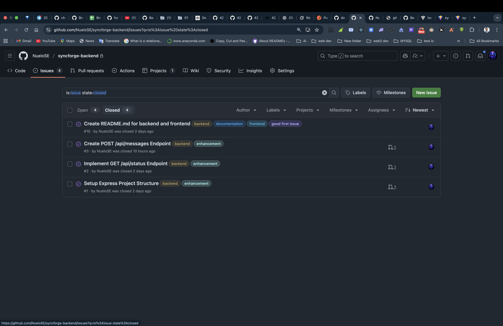
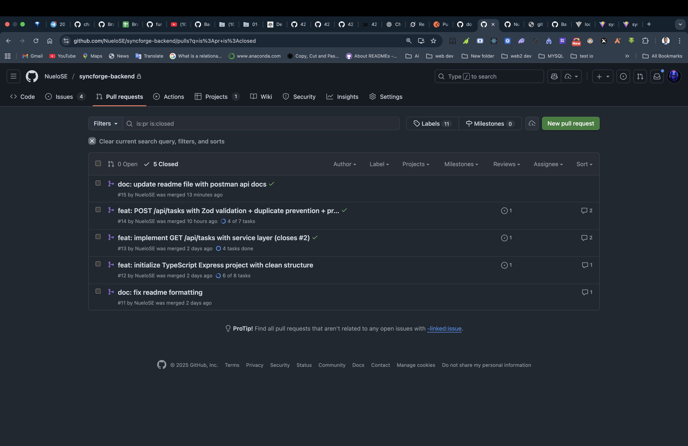

# SyncForge Backend

Fully remote-ready backend service for the SyncForge platform. Built with clean architecture, strict code review process, and distributed team collaboration in mind.

## Features

- TypeScript for type safety
- Clean layered architecture (`routes → controllers → services`)
- In-memory JSON file persistence (`data/tasks.json`)
- Input validation & error handling
- ESLint + Prettier enforced via GitHub Actions
- PR template & structured code reviews
- Postman collection for API documentation

## API Endpoints

| Method | Endpoint      | Description       | Status      |
| ------ | ------------- | ----------------- | ----------- |
| GET    | `/api/status` | Health check      | Done        |
| GET    | `/api/tasks`  | List all tasks    | In Progress |
| POST   | `/api/tasks`  | Create a new task | In Progress |

## Project Structure

```
src/
├── controllers/ # Request handlers & response formatting
├── routes/ # Express route definitions
├── services/ # Business logic & data access
├── middleware/ # Validation, error handling
├── types/ # Shared TypeScript interfaces
├── utils/ # Helper functions
├── data/ # JSON file storage (tasks.json)
└── server.ts # Entry point
```

## Collaboration Workflow

1. All work starts from a GitHub Issue
2. Branch naming: `feature/<issue-number>-short-description`
   - Example: `feature/1-setup-project-structure`
3. Never push directly to `main`
4. Every Pull Request must:
   - Link a GitHub Issue (`Closes #X`)
   - Use the PR template
   - Pass GitHub Actions (linting)
   - Receive mock review + approval
5. After merge → delete branch

### Code Review Philosophy

- Be kind, be specific, be constructive
- Focus on: readability, type safety, error handling, consistency
- Nits are welcome (formatting, naming, comments)
- At least 5+ review comments per PR (simulated)

## Branching Strategy

- `main` => Production-ready (protected branch)
- Feature branches => All development

## Setup & Running

```bash
# Clone and install
git clone https://github.com/NueloSE/syncforge-backend
cd syncforge-backend
npm install

# Run in development
npm run dev
# or
npm run build && npm start
```

GitHub Project Board
https://github.com/users/NueloSE/projects/1

## Postman Documentation

[SyncForge API](https://documenter.getpostman.com/view/49262917/2sB3dLTrYD)

## Opened and closed issues screenshot



## Pull Request screenshot


