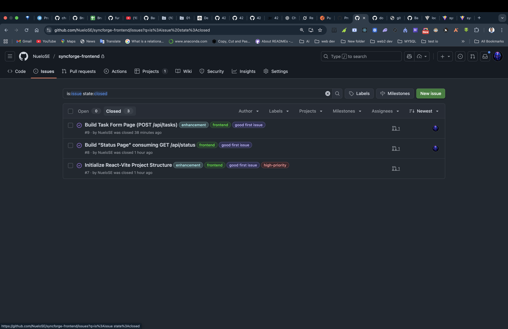
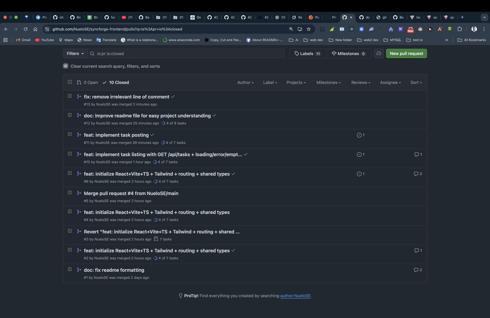

# SyncForge Frontend

Modern, type-safe React + Vite + TypeScript frontend for the **SyncForge** remote collaboration platform.  
Fully consumes and showcases the official SyncForge backend API with real-time feedback, loading states, and beautiful UX.

**Live Demo Routes**

- `/` → Backend health check
- `/tasks` → Full task management (list + create with validation)

## Features

- React 18 + Vite + TypeScript (zero `any`, strict mode)
- Tailwind CSS + custom design system
- Axios instance with automatic error handling
- Reusable components: `Loader`, `ErrorBanner`
- Full loading, success, error, empty, and duplicate states
- 100% typed API responses and error handling
- ESLint + Prettier + GitHub Actions CI
- PR template + mock code reviews (remote team workflow)

## Pages

| Route    | Purpose                           | Status |
| -------- | --------------------------------- | ------ |
| `/`      | Backend Status & Connection Test  | Done   |
| `/tasks` | List all tasks + create new tasks | Done   |

## Project Structure

```
src/
├── components/     → Reusable UI (Loader, ErrorBanner)
├── pages/          → Route-level pages (StatusPage, TasksPage)
├── services/       → Axios instance with interceptors
├── types/          → Shared TypeScript interfaces (Task, ApiResponse)
├── lib/            → Helpers (optional)
├── App.tsx         → React Router + layout
└── index.css       → Tailwind base + custom components
```

## Collaboration & Remote Team Workflow

This project strictly follows real-world distributed team practices:

1. All work starts from a GitHub Issue
2. Branch naming: `feature/<issue-number>-description`
3. Never commit directly to `main`
4. Every PR must:
   - Link an issue (`Closes #X`)
   - Use the PR template
   - Pass linting & tests via GitHub Actions
   - Include screenshots
   - Simulate code review with comments
5. Squash & merge → delete branch

**Code Review Philosophy**: Be kind, be specific, leave nits.

## Setup & Running (Important!)

**The backend server must be running first!**

```bash
# 1. Start the backend (separate terminal)
cd ../syncforge-backend
npm run dev
# → Should be running on http://localhost:4000

# 2. Start the frontend
git clone https://github.com/NueloSE/syncforge-frontend.git
cd syncforge-frontend
npm install
npm run dev
```

Open http://localhost:5173

## Scripts

```
Bashnpm run dev       # Start dev server
npm run build     # Production build
npm run preview   # Preview production build
npm run lint      # Run ESLint
```

## GitHub Actions

- Linting runs on every push/PR
- Merge blocked if lint fails
- Badge: Lint

## Opened and closed issues



## prs



##
