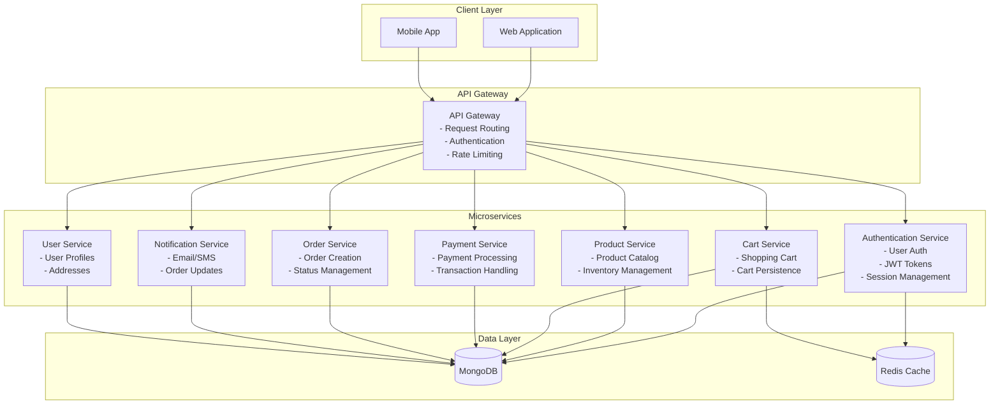

# E-commerce Cart Service

A microservice-based e-commerce cart system built with Node.js, Express, and MongoDB. This project demonstrates the implementation of a cart service as part of a larger microservices architecture for an e-commerce platform.

## 🏗️ Architecture Overview

### Current Monolithic System Analysis

The original monolithic e-commerce checkout process included:
- **User Authentication** - Login/registration, session management
- **Product Catalog** - Browse products, product details
- **Cart Management** - Add/remove items, update quantities
- **Payment Processing** - Payment gateway integration, transaction handling
- **Order Management** - Order creation, status tracking
- **Inventory Management** - Stock checking, reservation
- **Notification Service** - Email confirmations, order updates
- **User Profile** - Address management, order history

### Proposed Microservices Architecture



### Service Responsibilities

1. **Authentication Service** - Handles user registration, login, JWT token generation and validation
2. **Product Service** - Manages product catalog, categories, inventory, and product details
3. **Cart Service** - Manages shopping cart operations, cart persistence, and cart calculations
4. **Payment Service** - Processes payments, handles transactions, and payment gateway integration
5. **Order Service** - Creates orders, manages order status, and order history
6. **Notification Service** - Sends email/SMS notifications for order updates and confirmations
7. **User Service** - Manages user profiles, addresses, and preferences
8. **API Gateway** - Routes requests, handles authentication, and implements rate limiting

## 🚀 Features

### Authentication Service
- User registration and login
- JWT token-based authentication
- Password hashing with bcrypt
- Input validation and error handling

### Cart Service
- Add items to cart
- Update item quantities
- Remove items from cart
- Clear entire cart
- Real-time cart calculations
- Cart persistence per user

### Product Service
- Product catalog with pagination
- Category filtering
- Search functionality
- Product details and stock management

## 🛠️ Technology Stack

### Backend
- **Node.js** - Runtime environment
- **Express.js** - Web framework
- **MongoDB** - Database
- **Mongoose** - ODM for MongoDB
- **JWT** - Authentication tokens
- **bcryptjs** - Password hashing
- **express-validator** - Input validation
- **CORS** - Cross-origin resource sharing
- **Helmet** - Security headers
- **Morgan** - HTTP request logger

### Frontend
- **React** - UI library
- **Vite** - Build tool
- **React Router** - Client-side routing
- **Axios** - HTTP client
- **Tailwind CSS** - Styling framework
- **Heroicons** - Icon library

## 📁 Project Structure

```
ecommerce-backend/
├── src/
│   ├── config/
│   │   └── database.js          # MongoDB connection
│   ├── controllers/
│   │   ├── authController.js    # Authentication logic
│   │   ├── cartController.js    # Cart operations
│   │   └── productController.js # Product management
│   ├── middleware/
│   │   └── auth.js              # JWT authentication middleware
│   ├── models/
│   │   ├── User.js              # User schema
│   │   ├── Cart.js              # Cart schema
│   │   └── Product.js           # Product schema
│   ├── routes/
│   │   ├── auth.js              # Authentication routes
│   │   ├── cart.js              # Cart routes
│   │   └── products.js          # Product routes
│   ├── utils/
│   │   ├── jwt.js               # JWT utilities
│   │   └── seedData.js          # Sample data
│   └── server.js                # Main server file
├── seed.js                      # Database seeding script
├── package.json
├── env.example                  # Environment variables template
└── README.md
```

## 🔧 Installation & Setup

### Prerequisites
- Node.js (v16 or higher)
- MongoDB (v4.4 or higher)
- npm or yarn

### Backend Setup

1. **Clone the repository**
   ```bash
   git clone <repository-url>
   cd ecommerce-backend
   ```

2. **Install dependencies**
   ```bash
   npm install
   ```

3. **Environment Configuration**
   ```bash
   cp env.example .env
   ```
   
   Update the `.env` file with your configuration:
   ```env
   PORT=3001
   NODE_ENV=development
   MONGODB_URI=mongodb://localhost:27017/ecommerce_cart
   JWT_SECRET=your_super_secret_jwt_key_here
   JWT_EXPIRE=7d
   CORS_ORIGIN=http://localhost:5173
   ```

4. **Start MongoDB**
   ```bash
   # Using Docker
   docker run -d -p 27017:27017 --name mongodb mongo:latest
   
   # Or start your local MongoDB service
   sudo systemctl start mongod
   ```

5. **Seed the database**
   ```bash
   npm run seed
   ```

6. **Start the development server**
   ```bash
   npm run dev
   ```

   The server will start on `http://localhost:3001`

### Frontend Setup

The frontend repository is located at: [ecommerce-frontend](https://github.com/your-username/ecommerce-frontend)

1. **Navigate to frontend directory**
   ```bash
   cd ../ecommerce-frontend
   ```

2. **Install dependencies**
   ```bash
   npm install
   ```

3. **Start the development server**
   ```bash
   npm run dev
   ```

   The frontend will start on `http://localhost:5173`

## 📚 API Documentation

### Authentication Endpoints

#### POST `/api/auth/register`
Register a new user.

**Request Body:**
```json
{
  "username": "johndoe",
  "email": "john@example.com",
  "password": "password123",
  "firstName": "John",
  "lastName": "Doe"
}
```

**Response:**
```json
{
  "success": true,
  "message": "User registered successfully",
  "data": {
    "user": {
      "id": "user_id",
      "username": "johndoe",
      "email": "john@example.com",
      "firstName": "John",
      "lastName": "Doe"
    },
    "token": "jwt_token"
  }
}
```

#### POST `/api/auth/login`
Login with email and password.

**Request Body:**
```json
{
  "email": "john@example.com",
  "password": "password123"
}
```

#### GET `/api/auth/profile`
Get current user profile (requires authentication).

### Cart Endpoints

#### POST `/api/cart/add-to-cart`
Add an item to the cart (requires authentication).

**Request Body:**
```json
{
  "productId": "product_id",
  "quantity": 1
}
```

#### GET `/api/cart/get-cart/:userId`
Get user's cart (requires authentication).

#### PUT `/api/cart/update-item/:productId`
Update cart item quantity (requires authentication).

**Request Body:**
```json
{
  "quantity": 2
}
```

#### DELETE `/api/cart/remove-item/:productId`
Remove item from cart (requires authentication).

#### DELETE `/api/cart/clear-cart`
Clear entire cart (requires authentication).

### Product Endpoints

#### GET `/api/products`
Get all products with pagination and filtering.

**Query Parameters:**
- `page` - Page number (default: 1)
- `limit` - Items per page (default: 10)
- `category` - Filter by category
- `search` - Search term

#### GET `/api/products/:id`
Get single product by ID.

#### GET `/api/products/categories`
Get all product categories.

## 🧪 Testing

### Backend Testing
```bash
# Run tests
npm test

# Run tests with coverage
npm run test:coverage
```

### API Testing with Postman
Import the provided Postman collection to test all endpoints:
- Authentication flow
- Cart operations
- Product management

## 🚀 Deployment

### Environment Variables for Production
```env
NODE_ENV=production
PORT=3001
MONGODB_URI=mongodb://your-production-db-url
JWT_SECRET=your-production-jwt-secret
JWT_EXPIRE=7d
CORS_ORIGIN=https://your-frontend-domain.com
```

### Docker Deployment
```bash
# Build Docker image
docker build -t ecommerce-cart-service .

# Run container
docker run -p 3001:3001 --env-file .env ecommerce-cart-service
```

## 🔒 Security Features

- Password hashing with bcrypt
- JWT token authentication
- Input validation and sanitization
- CORS configuration
- Security headers with Helmet
- Rate limiting (can be added via API Gateway)

## 📊 Database Schema

### User Schema
```javascript
{
  username: String (unique, required)
  email: String (unique, required)
  password: String (hashed, required)
  firstName: String (required)
  lastName: String (required)
  createdAt: Date
  updatedAt: Date
}
```

### Cart Schema
```javascript
{
  userId: ObjectId (ref: User, unique, required)
  items: [{
    productId: String (required)
    name: String (required)
    price: Number (required)
    quantity: Number (required, min: 1)
    image: String
    description: String
  }]
  totalItems: Number (calculated)
  totalPrice: Number (calculated)
  createdAt: Date
  updatedAt: Date
}
```

### Product Schema
```javascript
{
  name: String (required)
  description: String (required)
  price: Number (required, min: 0)
  category: String (required)
  image: String
  stock: Number (required, min: 0)
  isActive: Boolean (default: true)
  createdAt: Date
  updatedAt: Date
}
```

## 🤝 Contributing

1. Fork the repository
2. Create a feature branch (`git checkout -b feature/amazing-feature`)
3. Commit your changes (`git commit -m 'Add some amazing feature'`)
4. Push to the branch (`git push origin feature/amazing-feature`)
5. Open a Pull Request

## 📝 License

This project is licensed under the MIT License - see the [LICENSE](LICENSE) file for details.

## 👥 Authors

- **Brave Redemptive** - *Initial work* - [GitHub](https://github.com/braveredemptive)

## 🙏 Acknowledgments

- Martin Fowler for microservices architecture guidance
- The Node.js and Express.js communities
- MongoDB documentation and best practices

## 📞 Support

For support, email support@example.com or create an issue in the repository.

---

**Note:** This is a proof of concept implementation for educational purposes. For production use, additional considerations such as comprehensive error handling, logging, monitoring, and security measures should be implemented.